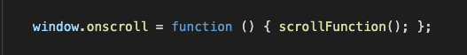
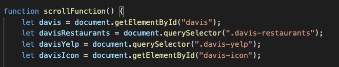

## Table of contents
* Background and overview
* Project link
* Functionality & MVP
* Architecture and Technologies

# Background and overview
UC College Town Facts is a scroller with data visualizations of demographics in each UC school along with live updates of the weather in each city and places to eat. The scroller format and different hover effects make the website interactive. The users can easily compare different information about each school by scrolling up and down.

# Project link
Here is a link to the live project: https://kevinpark02.github.io/college_town_facts/

# Functionality & MVP
Users are able to: 
* Scroll through the visualizations (9 slides)
* Hover over each of the charts to see more detailed information about the demographics
* Toggle between demographics chart and thelive weather chart
* Click on "Find Places to Eat" button to look for places to eat
* Hover over school icons to to the right to see general details about each school
* Toggle between visualizations of each school by using the navigation bar to the right

# Architecture and Technologies
The project uses the following technologies:

* `JavaScript` for scrolling and updating the displayed visualization correctly depending on the location of the website
* `anychart` for data visualization
* `OpenWeatherMap`to get live weather updates
* `Webpack` for bundling JS files

* I created a scrollFunction that is activated once the user begins to scroll. 
    
* The scrollFunction first declares various components of each school, and I achieved that by using getElementById or querySelector as shown below:
    
